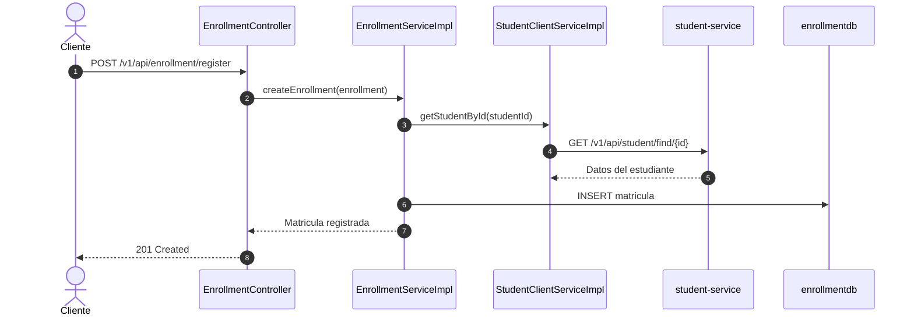

# Microservicio de Matriculas (enrollment-service)

Este proyecto implementa un microservicio transaccional basico para registrar matriculas de estudiantes. Trabaja junto al microservicio maestro **student-service**, porque cada matricula valida primero que el estudiante exista antes de guardar la operacion.

---

## Indice
1. [Objetivo](#1-objetivo)
2. [Arquitectura](#2-arquitectura)
3. [Consumo entre Servicios](#3-consumo-entre-servicios)
4. [Configuracion](#4-configuracion)
5. [Ejecucion Local](#5-ejecucion-local)
6. [Endpoints](#6-endpoints)
7. [Docker y Kubernetes](#7-docker-y-kubernetes)
8. [Buenas Practicas](#8-buenas-practicas)

---

## 1. Objetivo

El objetivo es proveer el servicio transaccional **enrollment-service**, encargado de registrar matriculas simples asociadas a estudiantes existentes. El servicio no duplica los datos del estudiante; solo guarda el `studentId` y consulta el detalle en **student-service** cuando lo necesita.

---

## 2. Arquitectura

```text
enrollment-service/
|
|-- src/main/java/com/enrollmentservice/
|   |-- controller/              # Endpoints REST
|   |-- service/                 # Contratos de negocio
|   |   |-- impl/                # Implementaciones
|   |-- repository/              # Persistencia JPA
|   |-- model/                   # Entidad Enrollment
|   |-- dto/                     # Respuestas compuestas
|   |-- config/                  # CORS y RestClient
|   |-- exception/               # Manejo global de errores
|   |-- EnrollmentServiceApplication.java
|
|-- src/main/resources/
|   |-- application.yml
|   |-- application-dev.yml
|   |-- application-prod.yml
|
|-- Dockerfile
|-- docker-compose.yml
|-- k8s/
|-- nginx/
|-- enrollment-service.postman_collection.json
|-- README.md
```

---

## 3. Consumo entre Servicios

El flujo principal es:



Variable importante:

```bash
STUDENT_SERVICE_URL=http://localhost:8090
```

Por defecto, `enrollment-service` espera que `student-service` este levantado en `http://localhost:8090`.

---

## 4. Configuracion

### application.yml

```yaml
server:
  port: ${SERVER_PORT:8095}

services:
  student:
    url: ${STUDENT_SERVICE_URL:http://localhost:8090}
```

### Perfil dev

Usa H2 en memoria:

```text
jdbc:h2:mem:enrollmentdb
```

### Perfil prod

Usa MySQL con variables:

- `DB_HOST`
- `DB_PORT`
- `DB_NAME`
- `DB_USER`
- `DB_PASSWORD`

---

## 5. Ejecucion Local

Primero levanta el servicio maestro:

```bash
cd ../student-service
mvn spring-boot:run -Dspring-boot.run.profiles=dev
```

Luego levanta matriculas:

```bash
cd ../enrollment-service
mvn spring-boot:run -Dspring-boot.run.profiles=dev
```

Servicios:

- Estudiantes: `http://localhost:8090`
- Matriculas: `http://localhost:8095`
- H2 matriculas: `http://localhost:8095/h2-console`

---

## 6. Endpoints

### Listar matriculas

```bash
curl -X GET http://localhost:8095/v1/api/enrollment/list
```

### Registrar matricula

Antes debe existir un estudiante con ID `1` en `student-service`.

```bash
curl -X POST http://localhost:8095/v1/api/enrollment/register \
  -H "Content-Type: application/json" \
  -d "{\"studentId\":1,\"courseName\":\"Programacion I\",\"enrollmentDate\":\"2026-07-02\",\"status\":\"ACTIVA\"}"
```

### Buscar matricula por ID

```bash
curl -X GET http://localhost:8095/v1/api/enrollment/find/1
```

### Ver detalle con estudiante

```bash
curl -X GET http://localhost:8095/v1/api/enrollment/detail/1
```

### Listar matriculas de un estudiante

```bash
curl -X GET http://localhost:8095/v1/api/enrollment/student/1
```

### Actualizar matricula

```bash
curl -X PUT http://localhost:8095/v1/api/enrollment/update/1 \
  -H "Content-Type: application/json" \
  -d "{\"studentId\":1,\"courseName\":\"Base de Datos\",\"enrollmentDate\":\"2026-07-02\",\"status\":\"ACTIVA\"}"
```

### Eliminar matricula

```bash
curl -X DELETE http://localhost:8095/v1/api/enrollment/delete/1
```

---

## 7. Docker y Kubernetes

### Docker Compose

```bash
docker compose up -d
docker compose ps
docker compose logs -f enrollment-service
docker compose down
```

El proxy Nginx queda disponible en:

```text
http://localhost:8096
```

### Kubernetes

```bash
kubectl apply -f k8s/namespace.yml
kubectl apply -f k8s/secret.yml
kubectl apply -f k8s/deployment.yml
kubectl apply -f k8s/service.yml
kubectl get all -n enrollment-namespace
kubectl port-forward service/enrollment-service 9095:80 -n enrollment-namespace
```

---

## 8. Buenas Practicas

- Separacion por capas: controller, service, repository, model y dto.
- Validacion de entrada con Jakarta Validation.
- Manejo global de errores con `@ControllerAdvice`.
- Consumo HTTP centralizado en `StudentClientService`.
- Persistencia independiente para el servicio transaccional.
- Configuracion por perfiles `dev` y `prod`.
